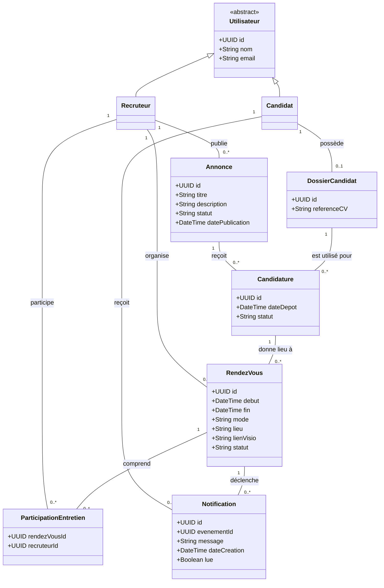
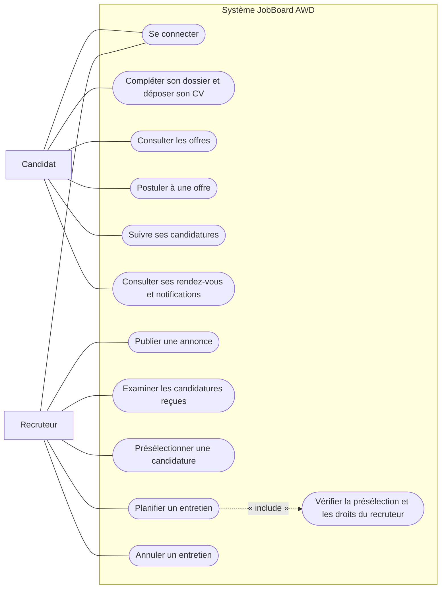

# Diagrammes UML — JobBoard AWD

## 1. Diagramme de classes

```mermaid
classDiagram
    direction TB

    class Utilisateur {
        <<abstract>>
        +UUID id
        +String nom
        +String email
    }

    class Candidat
    class Recruteur

    class DossierCandidat {
        +UUID id
        +String referenceCV
    }

    class Annonce {
        +UUID id
        +String titre
        +String description
        +String statut
        +DateTime datePublication
    }

    class Candidature {
        +UUID id
        +DateTime dateDepot
        +String statut
    }

    class RendezVous {
        +UUID id
        +DateTime debut
        +DateTime fin
        +String mode
        +String lieu
        +String lienVisio
        +String statut
    }

    class ParticipationEntretien {
        +UUID rendezVousId
        +UUID recruteurId
    }

    class Notification {
        +UUID id
        +UUID evenementId
        +String message
        +DateTime dateCreation
        +Boolean lue
    }

    Utilisateur <|-- Candidat
    Utilisateur <|-- Recruteur

    Candidat "1" -- "0..1" DossierCandidat : possède
    DossierCandidat "1" -- "0..*" Candidature : est utilisé pour
    Recruteur "1" -- "0..*" Annonce : publie
    Annonce "1" -- "0..*" Candidature : reçoit
    Candidature "1" -- "0..*" RendezVous : donne lieu à
    Recruteur "1" -- "0..*" RendezVous : organise
    RendezVous "1" -- "0..*" ParticipationEntretien : comprend
    Recruteur "1" -- "0..*" ParticipationEntretien : participe
    RendezVous "1" -- "0..*" Notification : déclenche
    Candidat "1" -- "0..*" Notification : reçoit
```

## 2. Diagramme de cas d’utilisation

```mermaid
flowchart LR
    C["Candidat"]
    R["Recruteur"]

    subgraph JOB["Système JobBoard AWD"]
        AUTH(["Se connecter"])
        DOS(["Compléter son dossier et déposer son CV"])
        OFF(["Consulter les offres"])
        POST(["Postuler à une offre"])
        SUIVI(["Suivre ses candidatures"])
        RDV(["Consulter ses rendez-vous et notifications"])

        PUB(["Publier une annonce"])
        EXAM(["Examiner les candidatures reçues"])
        PRE(["Présélectionner une candidature"])
        PLAN(["Planifier un entretien"])
        ANN(["Annuler un entretien"])
        VERIF(["Vérifier la présélection et les droits du recruteur"])
    end

    C --- AUTH
    C --- DOS
    C --- OFF
    C --- POST
    C --- SUIVI
    C --- RDV

    R --- AUTH
    R --- PUB
    R --- EXAM
    R --- PRE
    R --- PLAN
    R --- ANN

    PLAN -. "« include »" .-> VERIF
```
